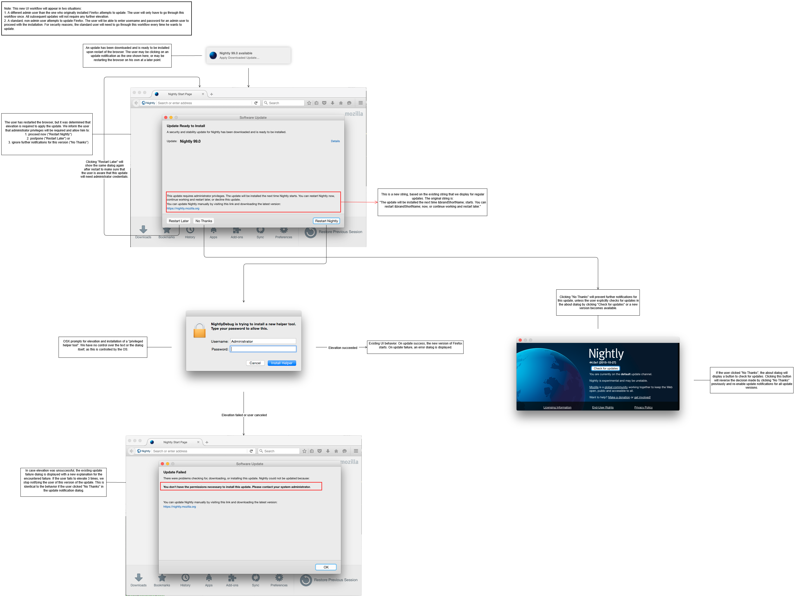

# macOS Elevated Update

When an Admin user installs Firefox, it will be installed with privileges that
allow the Firefox updater to write to the installation files as that user. When
we use elevation to update, we change the permissions on the install directory
such that any Admin user can also do this. This means that the macOS elevated
update flow is:

- Never needed when updating as the installing user.
- Needed once to update from Admin users other than the installing user.
- Needed every time for non-Admin users.

## UI Flowchart

This flow is what the user experiences in order to initiate an elevated update:

## Algorithm Flowchart

